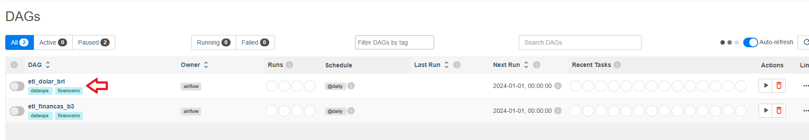
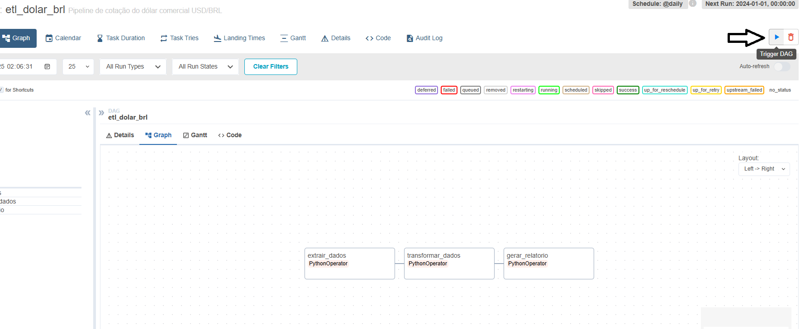
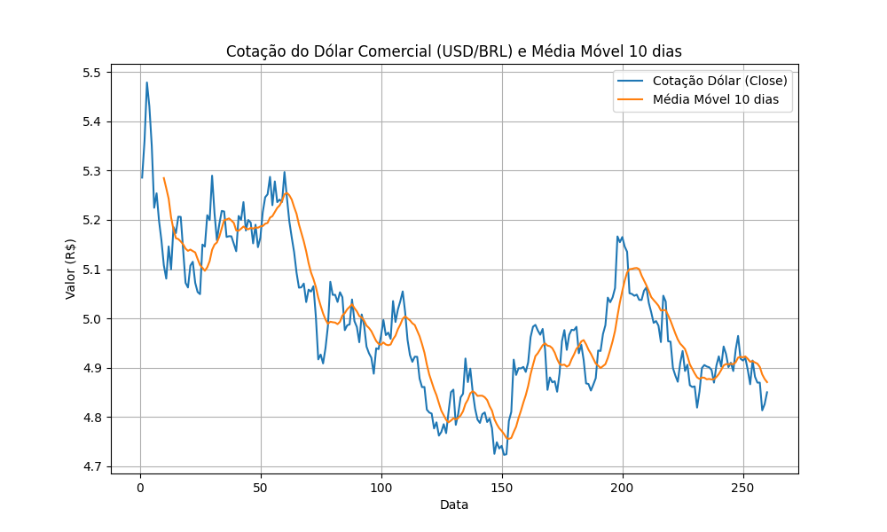

# Pipeline ETL para Cotação do Dólar Comercial (USD/BRL) com Apache Airflow

Este projeto implementa uma DAG no Apache Airflow para coletar, processar e visualizar dados históricos da cotação do dólar comercial em relação ao real brasileiro (USD/BRL) durante o ano de 2023.


## Tecnologias Utilizadas

- **Apache Airflow**: Orquestração e agendamento das tarefas.
- **PythonOperator**: Execução das funções Python para cada etapa do pipeline.
- **yfinance**: Extração dos dados financeiros históricos.
- **pandas**: Manipulação e transformação dos dados.
- **matplotlib**: Geração do gráfico de visualização.
- **Docker & Docker Compose**: Ambiente containerizado para execução do Airflow.

---

## Estrutura da DAG `etl_dolar_brl`

A DAG é composta por três tarefas principais, executadas em sequência:

1. **Extração (`extrair_dados`)**  
   Coleta os dados históricos da cotação do dólar comercial (ticker `USDBRL=X`) entre 01/01/2023 e 31/12/2023 usando a biblioteca `yfinance`.  
   Os dados brutos são salvos em `dags/data/dolar_raw.csv`.

2. **Transformação (`transformar_dados`)**  
   Lê os dados brutos, remove valores nulos, converte o campo de fechamento (`Close`) para numérico e calcula a média móvel de 10 dias.  
   O resultado é salvo em `dags/data/dolar_tratado.csv`.

3. **Visualização (`gerar_relatorio`)**  
   Gera um gráfico comparativo entre a cotação diária do dólar e a média móvel de 10 dias, utilizando `matplotlib`.  
   O gráfico é salvo em `dags/reports/relatorio_dolar.png`.

---

## Executando o projeto

1. Criando o container do Airflow

```docker-compose build```

```docker-compose up -d```

```docker exec -it airflow_web airflow users create --username airflow --firstname Admin --lastname User --role Admin --email admin@example.com --password airflow```

2. Aplicação disponível em:

`http://localhost:8088/`



3. Executando pipeline via Trigger DAG



4. Relatório gerado


